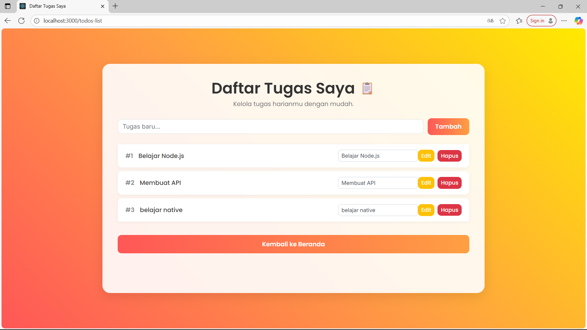
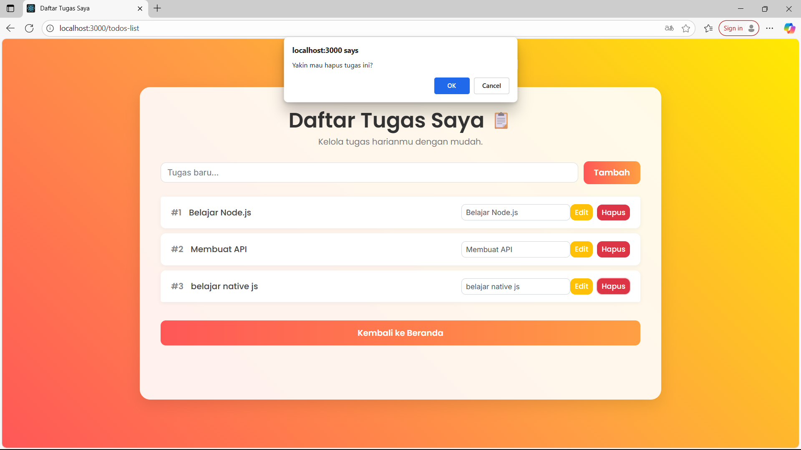
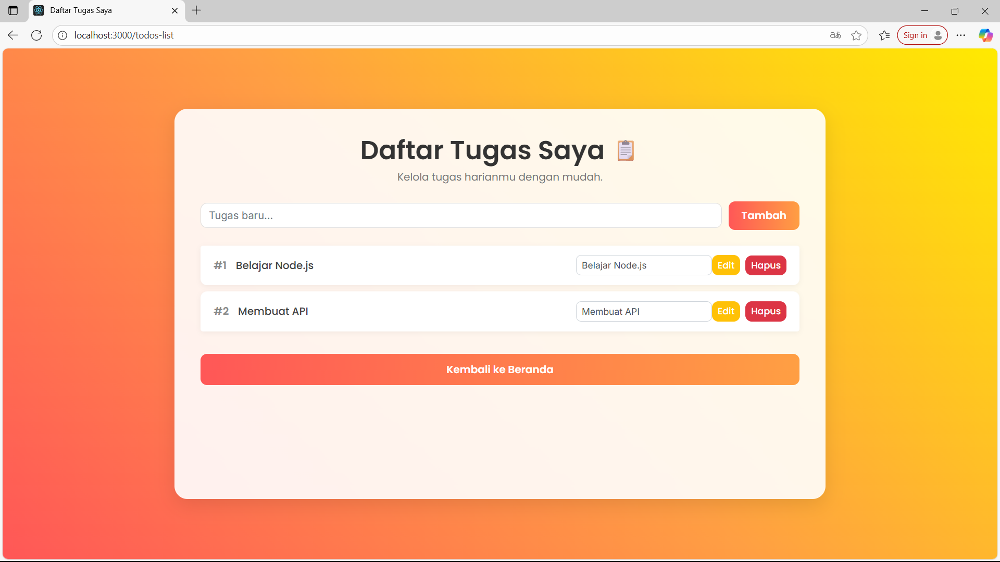

# Implementasi Method Testing (Post, Put, Delete) di Todos-List Page

## 1. Tampilan GET

## 2. Tampilan Sebelum POST

## 3. Tampilan Sesudah POST

## 4. Tampilan Sebelum Method PUT

## 5. Tampilan Sesudah Method PUT

## 6. Tampilan DELETE

## 7. Tampilan Sesudah DELETE

