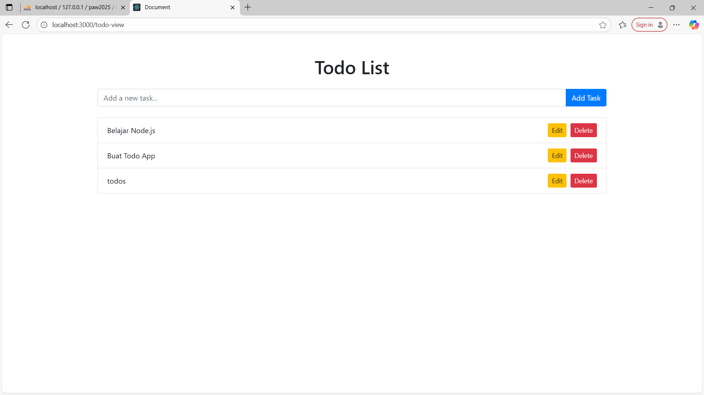

# Tugas 6 - Menampilkan Data Todo dari Database

## 1. Tampilan Browser Halaman Todo-View

> Gambar di atas menunjukkan halaman todo yang sudah menampilkan data dari database.

## 2. Tabel Todo di phpMyAdmin

> Gambar di atas menunjukkan tabel `todo` di phpMyAdmin yang berisi data todo yang sudah tersimpan di database.
