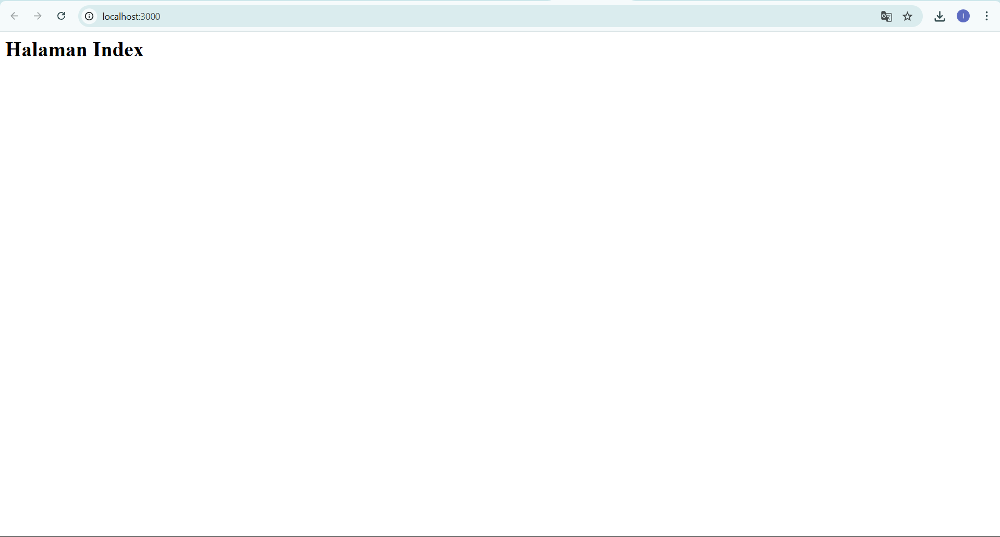
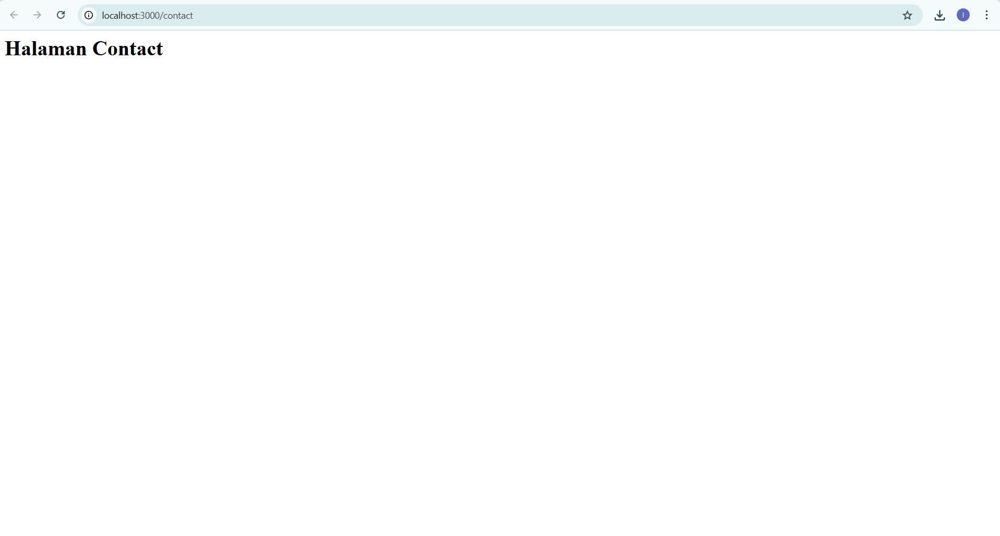

# Praktikum 3 - Routing dan Middleware

## NIM: 20220140198  
## Nama: Inggar Kinanthi Sandong Guritno

### ✅ Tampilan Halaman Index


### ✅ Tampilan Halaman Contact


### 📜 Penjelasan Kode
```js
const express = require('express');
const app = express();
const port = 3000;

app.use((req, res, next) => {
  console.log(`[${new Date().toISOString()}] ${req.method} ${req.url}`);
  next();
});

app.get('/', (req, res) => {
  res.send('<h1>Halaman Index</h1>');
});

app.get('/contact', (req, res) => {
  res.send('<h1>Halaman Contact</h1>');
});

app.listen(port, () => {
  console.log(`Server berjalan di http://localhost:${port}`);
});
